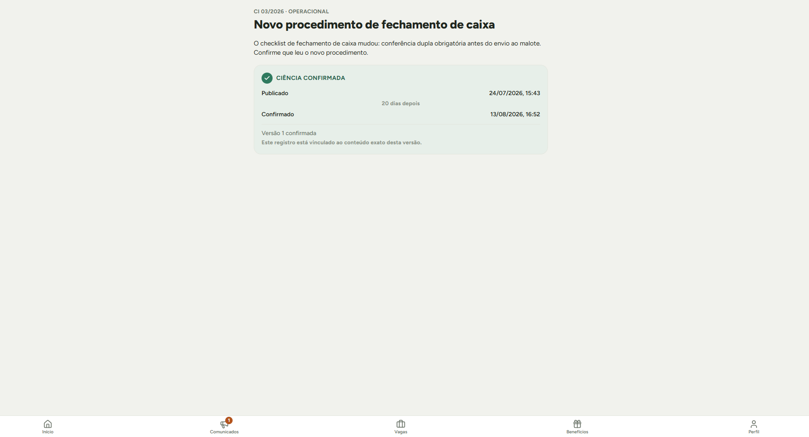
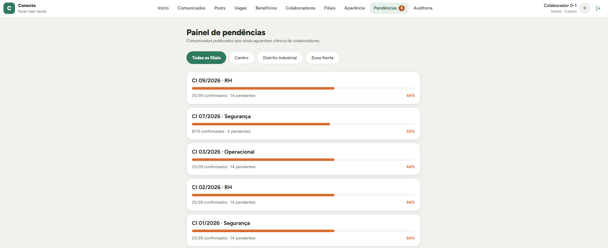
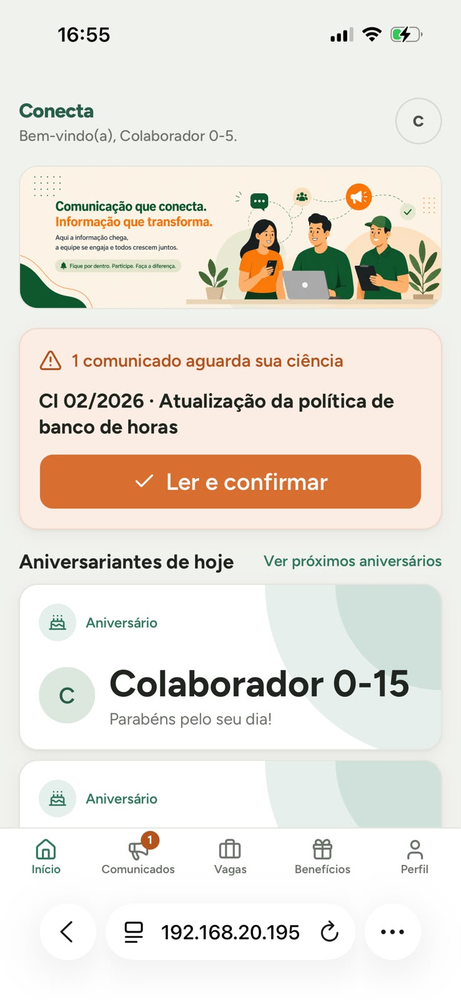
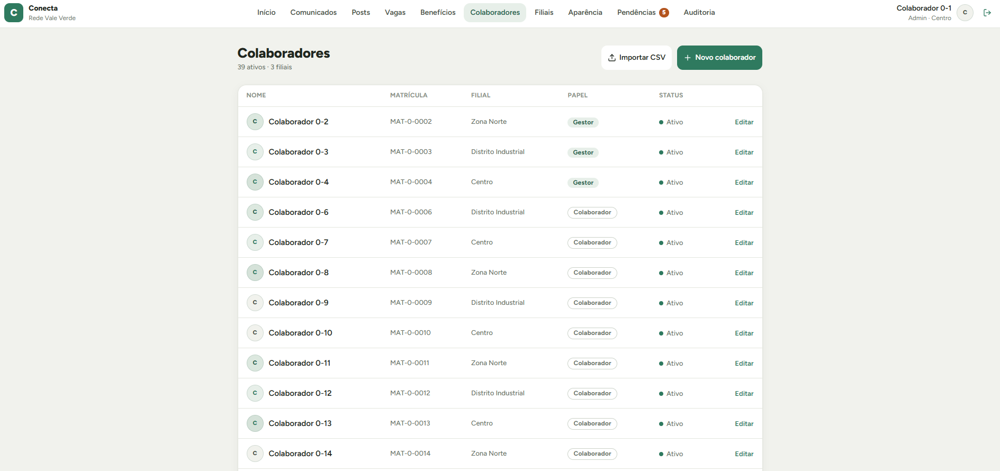

# Conecta

Plataforma multi-tenant de comunicação interna para empresas com operação distribuída em filiais. O núcleo do produto não é o mural — é a **prova de que a informação chegou**.

Projeto próprio, em fase pré-piloto. Concepção, arquitetura e implementação por [Pedro Catrinck](https://linkedin.com/in/pedromcatrinck).

---

## O problema

Empresas de operação — varejo, indústria leve, logística — precisam comunicar mudança de procedimento, norma de segurança e aviso de escala para gente que não trabalha na frente de um computador. Na prática isso acontece por grupo de WhatsApp, papel no mural e recado de encarregado.

Quando um procedimento é descumprido, a pergunta que aparece é: **o colaborador foi informado?**

Grupo de WhatsApp não responde isso. Lista assinada em papel responde mal e não escala para múltiplas filiais. Portais internos, quando existem, tratam a comunicação como conteúdo — não como registro.

O Conecta trata o comunicado como registro desde o desenho: publicar gera um documento versionado, e cada confirmação de leitura grava quem confirmou, quando, e o hash do conteúdo exato que estava na tela naquele momento.

---

## Como funciona

Um comunicado publicado recebe numeração sequencial por ano (`CI 03/2026`), categoria e criticidade. Quando exige ciência, aparece como pendência para os colaboradores das filiais destinatárias até ser confirmado.



O que a tela mostra é o que sustenta o produto: **data de publicação e data de ciência com o mesmo peso**, o intervalo entre as duas, e a versão do documento que foi efetivamente confirmada. Se o comunicado foi editado depois da confirmação sem alteração material, a tela avisa que a ciência se refere a uma versão anterior — o registro nunca é reapresentado como se fosse sobre o texto atual.

Do lado do gestor, o painel de pendências mostra a cobertura por comunicado e permite filtrar por filial.



A comprovação sai em CSV com uma linha por confirmação: colaborador, matrícula, filial, versão, data de publicação, hash do conteúdo e data da ciência. É o artefato que um RH levaria para uma audiência.

### O que segura o uso diário

Um sistema que só cobra leitura de norma é aberto uma vez por mês. Por isso o produto tem camada de engajamento: feed com reconhecimentos e avisos, aniversariantes, vagas internas com candidatura de um toque, e clube de benefícios.



A interface é mobile-first por decisão explícita ([ADR-002](docs/02-Arquitetura/ADR/ADR-002-pwa-mobile-first.md)) — o colaborador de loja acessa pelo próprio celular, e esse é o caso principal, não o secundário.

### Papéis e escopo

Três papéis: administrador, gestor (escopo de uma filial) e colaborador. A navegação muda por papel ([ADR-009](docs/02-Arquitetura/ADR/ADR-009-navegacao-por-papel.md)) em vez de esconder botões de uma interface única.



---

## O que é tecnicamente difícil aqui

### Isolamento multi-tenant que não é decorativo

Row-Level Security no PostgreSQL não vale nada se a aplicação conecta como superuser — o superuser ignora RLS por definição. O Conecta separa a role de migração da role de runtime: a aplicação conecta como `conecta_app`, que **não é superuser**, com `FORCE ROW LEVEL SECURITY` e política default-deny em todas as 19 tabelas de domínio.

Isso é verificado por 360 testes automatizados, não por convenção. A suíte falha se uma tabela nova entrar no schema sem política de RLS, e uma matriz de GRANTs falha em três direções: privilégio excedente, privilégio ausente e divergência entre o esperado e o concedido.

### Imutabilidade garantida no banco, não na aplicação

Confirmação de leitura é registro probatório: não pode ser editada nem apagada. A garantia está em trigger de banco que recusa `UPDATE`, `DELETE` e `TRUNCATE` **independentemente da role ou do GRANT** — inclusive contra a role owner. Aplicação futura descuidada, script administrativo ou migração mal escrita não conseguem alterar o registro.

### Numeração sequencial à prova de corrida

`CI 03/2026` tem significado externo: é como o documento é referenciado em processo interno. Duas publicações simultâneas não podem receber o mesmo número. A alocação usa `INSERT … ON CONFLICT … RETURNING` sobre uma tabela de sequência por tenant e ano, e há teste de integração que dispara publicações concorrentes e verifica ausência de duplicata.

### Versionamento com hash de conteúdo

Editar um comunicado publicado cria versão nova. A confirmação aponta para a versão que estava na tela, com o hash do conteúdo gravado no momento do ack. Se o texto mudar depois, o registro continua provando o que foi lido — não o que está lá hoje.

O hash é artefato interno de integridade, exposto no comprovante exportado e não na interface ([ADR-001](docs/02-Arquitetura/ADR/ADR-001-comunicado-entidade-nativa.md)).

### CPF nunca em texto claro

O login é por CPF, mas o CPF não é armazenado. O que existe no banco é um hash com pepper fora do banco. A consequência é assumida e documentada: rotacionar o pepper invalida todos os logins até um re-hash — que não é possível a partir do hash, porque o CPF em claro não existe. O procedimento de rotação e suas implicações estão escritos em [docs/02-Arquitetura/rotacao-pepper.md](docs/02-Arquitetura/rotacao-pepper.md).

### Migrações escritas à mão

O schema tem uma coluna `GENERATED ALWAYS AS … STORED` para busca textual, que o Prisma só representa como tipo não suportado. Rodar `prisma migrate dev` gera um diff espúrio sobre essa coluna e pode disparar reset do banco. Por isso as migrações são escritas manualmente e aplicadas com `migrate deploy` — decisão registrada em [ADR-008](docs/02-Arquitetura/ADR/ADR-008-migracoes-manuais-colunas-generated.md) depois de três incidentes.

---

## Como rodar

Requisitos: Node 20+, Docker, Docker Compose e [gitleaks](https://github.com/gitleaks/gitleaks#installing) (usado pelo hook de pre-commit — `npm ci` já instala o hook em si via `husky`, só o binário do gitleaks precisa ser instalado à parte).

```bash
git clone https://github.com/pedromcatrinck/conecta.git
cd conecta
npm ci
cp .env.example .env          # preencha os valores
docker compose up -d          # PostgreSQL local
npx prisma migrate deploy     # aplica as migrations (nunca migrate dev — ver ADR-008)
npx prisma db seed            # popula a base de demonstração
npm run dev
```

Acesse `http://localhost:3000/vale-verde`.

### Base de demonstração

O seed cria um tenant fictício — **Rede Vale Verde** — com 3 filiais, ~40 colaboradores, comunicados em estados variados (publicado, agendado, arquivado, rascunho), confirmações parciais, feed, vagas e benefícios. Todos os dados são sintéticos; os colaboradores têm rótulos genéricos por desenho.

| Papel | CPF | Senha inicial |
|---|---|---|
| Administrador | `100.000.000-00` | `Trocar123!` |
| Colaborador | `100.000.000-04` | `Trocar123!` |

O primeiro acesso exige definir uma senha nova. Isso é intencional: o registro de ciência só tem valor se a credencial pertencer ao colaborador, e não ao administrador que a distribuiu ([ADR-006](docs/02-Arquitetura/ADR/ADR-006-ciclo-de-vida-usuario-e-auth.md)).

---

## Stack

Next.js (App Router) · TypeScript · Tailwind · shadcn/ui · PostgreSQL com Prisma e RLS · Auth.js com sessão revogável em banco · Web Push (VAPID) · MinIO (S3-compatível) · Docker Compose

Resolução de tenant por path (`/{slug}`) em vez de subdomínio, para simplificar TLS e onboarding ([ADR-010](docs/02-Arquitetura/ADR/ADR-010-resolucao-tenant-por-path.md)). Infraestrutura self-hosted em VPS único, com todos os dados em território nacional ([ADR-011](docs/02-Arquitetura/ADR/ADR-011-infraestrutura-e-implantacao.md)).

---

## Método

Este repositório não é só código. Em `docs/` há um vault de decisão que precede a implementação:

- **12 ADRs** — cada decisão de arquitetura com contexto, alternativas rejeitadas, consequências assumidas e gatilho de revisão. Inclusive as que foram substituídas por decisões posteriores.
- **31 INCs** — cada incremento especificado antes de ser escrito: escopo, fora de escopo, critérios de aceite e relatório de entrega ligado ao commit de merge.
- **DPs** — decisões pendentes registradas em vez de resolvidas por impulso, com o que cada uma bloqueia.
- **Auditorias** — revisões com severidade classificada, feitas em modo somente-leitura antes de qualquer correção.

O fluxo é: especificar, decidir, implementar em branch própria, QA manual, merge sem fast-forward. Commits seguem Conventional Commits e nada entra direto na `main`.

A implementação é assistida por agente de código, com a documentação como fonte de verdade e revisão manual como gate de merge. O vault existe justamente para isso funcionar: o agente executa contra uma especificação escrita, não contra uma conversa.

Vale um exemplo de por que o método importa. Durante a preparação deste repositório, uma leitura atenta da tela de leitura revelou que `publish_at` nunca era gravado na publicação imediata — só no agendamento. O campo existia, as consultas ordenavam por ele corretamente, os testes passavam, e o comprovante exportado não tinha a data de publicação. A tese do produto depende de demonstrar o intervalo entre publicação e ciência, e metade do intervalo não estava sendo registrada. Suíte verde não é o mesmo que produto correto.

---

## Status

**Pré-piloto, em desenvolvimento ativo.** O núcleo está implementado e testado; não há usuário real ainda.

O que falta para o piloto:

- Armazenamento de mídia em produção (hoje as features de imagem rodam sobre um mock local; MinIO é pré-requisito)
- Ciclo de anonimização de desligados, exigido antes de qualquer dado real
- Aviso de privacidade em versão jurídica — o arquivo em `docs/03-LGPD/` é minuta, com campos que dependem de revisão profissional e de dados do controlador
- Validação de Web Push em iOS (implementado, não validado)
- Arquivamento contínuo de WAL antes do segundo cliente

Essas pendências são deliberadas e registradas, não descobertas. O que segura o piloto hoje é dependência externa — jurídico e infraestrutura paga — não backlog técnico.

---

## Estrutura

```
docs/
  00-Processo/      convenções, fluxo de trabalho, auditorias
  01-Produto/       visão, escopo do MVP, personas
  02-Arquitetura/   ADRs, modelo de dados, stack, infraestrutura
  03-LGPD/          bases legais, requisitos técnicos, aviso de privacidade
  04-Roadmap/       roadmap e um INC por incremento
  05-Decisoes-Pendentes.md
  06-Design/        design system e tokens
prisma/             schema, migrations manuais, seed de demonstração
src/                aplicação
```

Sugestão de leitura, para quem quiser entender o desenho em vez do código: [visão e tese](docs/01-Produto/visao-e-tese.md), [ADR-003 (multi-tenant)](docs/02-Arquitetura/ADR/ADR-003-multi-tenant.md), [ADR-001 (comunicado como entidade nativa)](docs/02-Arquitetura/ADR/ADR-001-comunicado-entidade-nativa.md).

---

## Licença

Todos os direitos reservados. O código está público para leitura e avaliação; uso comercial depende de autorização.
